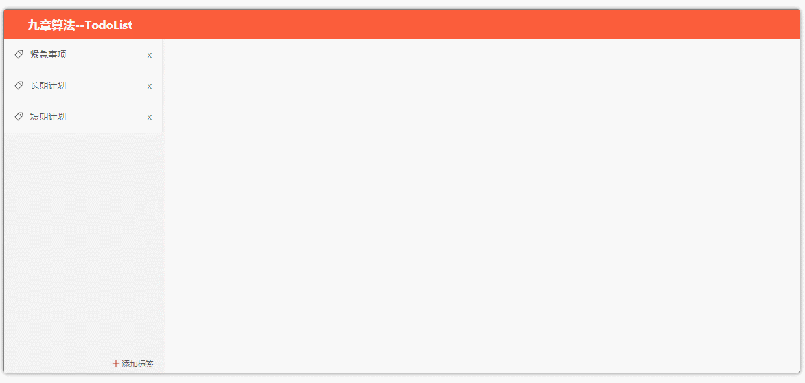
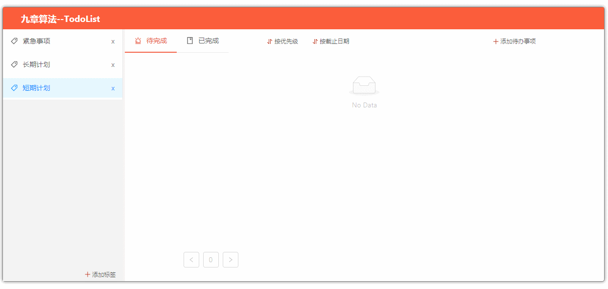
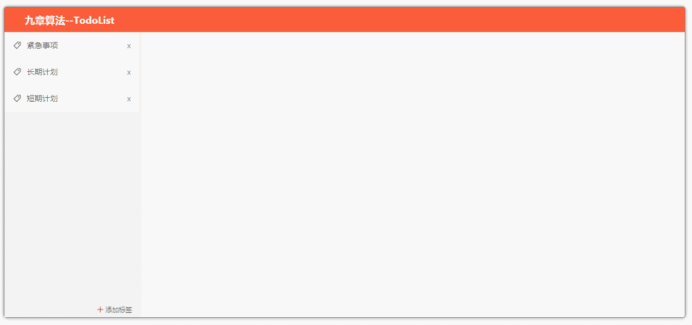
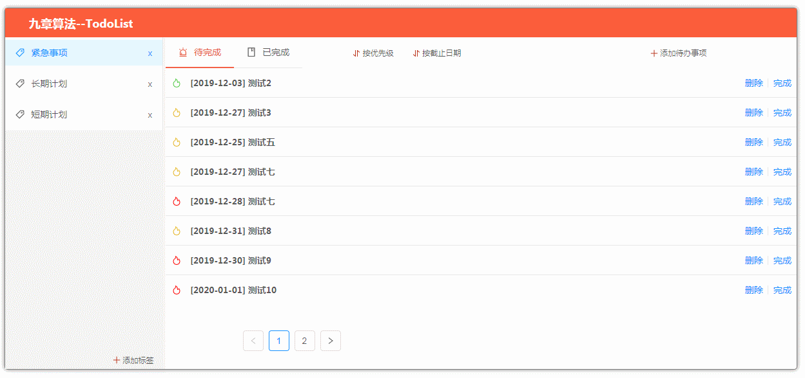

# Todolist  
## 项目说明：  
技术栈：Django，django restful api，react， postgreSQL  

项目背景：九章算法的实习题，实现一个Todolist。具备增删标签、增删待办事项、按时间/优先级排序。  
  
个人感悟：第一次接触django和restful api这么个概念，虽然django只是提供接口，但几天学习下来仍然收获颇多，尤其是restful api，之前开发时就发现了增删改查的接口繁琐又重复的问题，restful规范的确优雅，值得学习。
## 功能截图：  
1. 创建/删除标签  
  
2. 创建/删除待办事项  
  

3. 分页功能  

4. 排序功能  

## 其他说明  
前端源码文件在todolist-react目录下,使用前需进入前端目录`npm install`安装下所有依赖包。  
后端源码文件在todolist目录下  

前端负责搭建UI界面，后端提供接口（restful api），后端接口可用其他服务端框架替代，只需要提供对应接口即可。  
